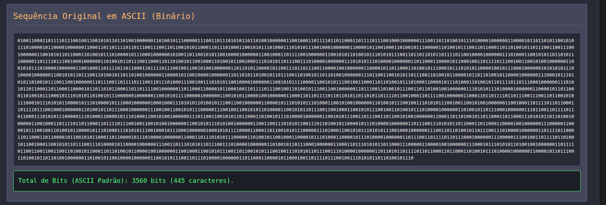

# Visualizador de Algoritmo de Huffman

**Número da Lista**: 3
**Conteúdo da Disciplina**: Algoritmos Ambiciosos

## Aluno

| **Matrícula** | **Nome** | 
| 19/0048191    | Renan Rodrigues Lacerda   |

## Link vídeo: [Video]()

## Sobre

Este projeto tem como objetivo aplicar e demonstrar visualmente os conceitos do algoritmo de Codificação de Huffman, uma técnica de compressão de dados sem perdas. A aplicação permite ao utilizador inserir um texto qualquer, e a partir daí, calcula a frequência de cada caractere. Com base nessas frequências, uma Árvore de Huffman é construída dinamicamente e visualizada como um grafo interativo.

Após a construção da árvore, os códigos de Huffman para cada caractere são gerados e exibidos. O texto original é então codificado usando esses códigos, resultando numa sequência de bits comprimida. Para fins comparativos, a representação binária original do texto em ASCII e as estatísticas de compressão (taxa de compressão, economia de bits) são também apresentadas, permitindo ao utilizador observar a eficácia do algoritmo para diferentes entradas de texto.

## Screenshots
### Interface Inicial Limpa

 

### Exibição da Frequência dos Caracteres

 

### Tabela de Códigos de Huffman Gerados

 

### Visualização da Árvore de Huffman como Grafo

 

### Representação Binária ASCII do Texto Original

 

### Sequência de Bits Comprimida e Estatísticas

 

## Instalação

**Linguagem**: HTML, CSS, Javascript

**Bibliotecas Externas**:

* Tailwind CSS (via CDN, para estilização base)

* Vis.js Network (via CDN, para visualização do grafo da árvore)

**GitHub Pages (Exemplo)**: [VisualizadorHuffman](https://projeto-de-algoritmos-2025.github.io/Greed_HuffmanLab/)

**Pré-requisitos**:

* Navegador de internet moderno (Google Chrome, Firefox, Edge, Safari, etc.)

Este projeto é totalmente executado no navegador. Não requer instalação de dependências adicionais ou execução de servidores. Basta abrir o arquivo `index.html` em qualquer navegador moderno.

## Uso

### Passos para utilizar o visualizador:

1. **Insira o Texto**:

   * Digite ou cole o texto que deseja analisar e comprimir na área de texto designada "Seu Texto Original:".

2. **Gere a Análise**:

   * Clique no botão "Analisar e Comprimir Texto".

3. **Observe os Resultados**:

   * A aplicação irá processar o texto e exibir as seguintes informações em secções distintas:

     * **Frequência dos Caracteres**: Uma lista de cada caractere presente no texto e quantas vezes ele aparece.

     * **Códigos de Huffman Gerados**: A tabela mostrando cada caractere e o seu código binário de Huffman correspondente.

     * **Árvore de Huffman (Grafo)**: Uma visualização gráfica interativa da Árvore de Huffman construída. Pode fazer zoom e arrastar os nós.

     * **Sequência Original em ASCII (Binário)**: A representação binária do seu texto original, assumindo 8 bits por caractere (ASCII padrão), e a contagem total de bits.

     * **Texto Comprimido (Huffman)**: A sequência de bits resultante da aplicação dos códigos de Huffman ao seu texto original, e as estatísticas detalhadas sobre a compressão (tamanho original em bits, tamanho comprimido em bits, bits economizados e a taxa de compressão).

## Outros

* Toda a lógica de cálculo de frequência, construção da árvore, geração de códigos e compressão é executada diretamente no navegador do utilizador.